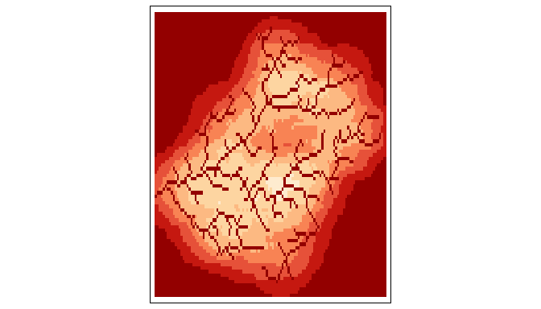

## StreamSignatuR

The file [R/functions.R](R/functions.R) contains the code for the
StreamSignature() function and auxiliary functions required.

The following examples show how to use the function. The R code in this
markdown document is also saved as a simple R script [main.R](main.R)

<br>

<br> *… more documentation required …* <br>

<br>

#### Read input data

Load stream raster.

``` r
r <- rast("data/stream_upstr_basin.tif")
```

Load stream flux raster.

``` r
rf <- rast("data/StreamFlux.tif")
```

Load fractional composition of benthic organism groups.

``` r
rc <- rast("data/Benthic_Composition.tif")
```

#### Calculate Stream signatures

Calculate stream signature using only stream raster.

``` r
r2 <-StreamSignature(r)
```

Calculate stream signature using a flux raster.

``` r
r3 <-StreamSignature(r, rf)
```

Calculate stream signature using a flux raster and a benthic composition
raster.

``` r
r4 <-StreamSignature(r, rf, rc)
tm_shape(r4)+
  tm_raster(legend.show = F, palette = "-OrRd" ) 
```

<!-- -->

Benthic composition can also be supplied as a spatially-invariant list.

``` r
rclist <- list(E=0.25,P=0.25,T=0.25,C=0.25)
r5 <-StreamSignature(r, rf, rclist)
```

The StreamSignature function gives a warning if the sums of organism
group composition fractions are not equal to 1.0. By default,
calculations will continue anyway. In this case, the weighted signatures
will be normalised to the sum of fractions i.e. each original fraction
is effectively replaced by its fraction of the sum of fractions

$f_{normalised} = f / \sum_{1}^{n} f_i$

There is an option to cause an error and stop processing if the sums of
organism group fractions are not equal to 1.0.

``` r
rclist <- list(E=0.25,P=0.25,T=0.25,C=0.27)
r6 <-StreamSignature(r, rf, rclist, options=list(check_composition_sums=T))
```

    ## Warning: For 747 river cells, the sum of organism composition fractions was not equal to 1.0
    ## Stopping processing and returning the dataframe of cell values

As you can see, the function returns the dataframe with all combinations
of stream cells and matching land cells, along with the corresponding
values of flux and benthic composition fractions.

``` r
print(head(r6))
```

    ## # A tibble: 6 × 11
    ##   cellLand   lon   lat  lonS  latS  flux cellStream  d_km OrgGroup fraction
    ##      <dbl> <dbl> <dbl> <dbl> <dbl> <dbl>      <dbl> <dbl> <chr>       <dbl>
    ## 1       37  9.33  54.8  9.34  54.8  8.24        754 0.976 E            0.25
    ## 2       37  9.33  54.8  9.34  54.8  8.24        754 0.976 P            0.25
    ## 3       37  9.33  54.8  9.34  54.8  8.24        754 0.976 T            0.25
    ## 4       37  9.33  54.8  9.34  54.8  8.24        754 0.976 C            0.27
    ## 5       38  9.33  54.8  9.34  54.8  8.24        754 0.933 E            0.25
    ## 6       38  9.33  54.8  9.34  54.8  8.24        754 0.933 P            0.25
    ## # ℹ 1 more variable: OrgGroupName <chr>

The function will only recognise benthic group fractions specified using
the following names: A, C, E, P, T

- A - All aquatic insects
- C - Chironomids
- E - Mayflies
- P - Stoneflies
- T - Caddisflies

``` r
rclist <- list(E=0.25,P=0.25,T=0.25,X=0.25)
r7 <-StreamSignature(r, rf, rclist)
```

    ## Warning: The composition list contained 4 values: E, P, T, X
    ## Only the following names were recognized: E, P, T

    ## Warning: For 747 river cells, the sum of organism composition fractions was not equal to 1.0

Note that in this case, the group “X” is not recognized.

So the weighting for each of the remaining 3 groups becomes:

0.25 / (0.25 + 0.25 + 0.25) = *0.333*
